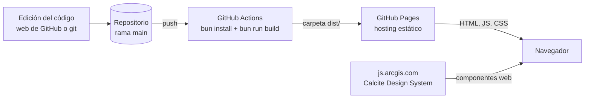
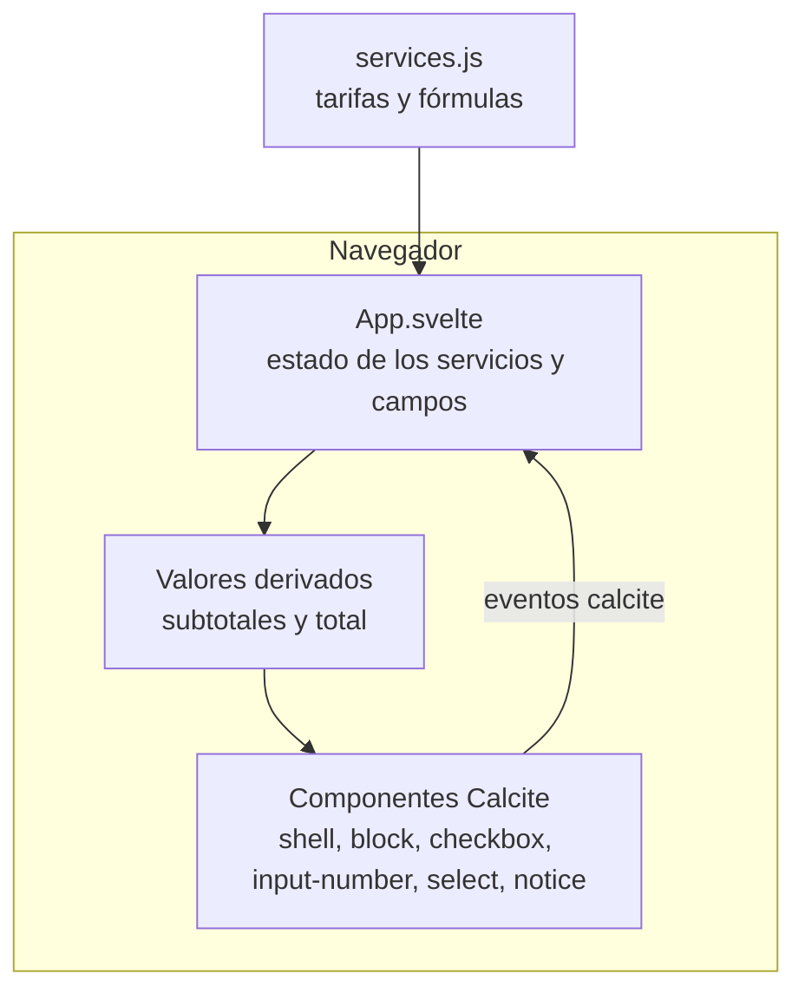

# Calculadora de créditos de ArcGIS Online

Herramienta web que **estima cuántos créditos de ArcGIS Online consumirá un proyecto**, de acuerdo con la [tabla oficial de créditos por servicio](https://doc.arcgis.com/es/arcgis-online/administer/credits.htm). El resultado se actualiza al instante y no se guarda ni se envía ningún dato.

**Abrir la calculadora:** https://raisavll.github.io/calculadora-creditos-agol/

---

## ¿Qué es y para qué sirve?

ArcGIS Online cobra por créditos, y cada servicio tiene su propia tarifa: unos se cobran por gigabyte al mes, otros por cada mil operaciones y otros por hora de uso. Estimar el consumo de un proyecto obliga a revisar la tabla oficial y hacer varias cuentas a mano.

Esta calculadora hace esas cuentas por ti. Sirve para:

- **Presupuestar** un proyecto antes de empezar a usar los servicios.
- **Comparar escenarios**, por ejemplo cuánto cambia el consumo si el almacenamiento dura 3 meses en lugar de 1.
- **Saber qué servicio pesa más** en el total, gracias al desglose por servicio.

Es una **estimación**: no está conectada a tu cuenta de ArcGIS Online y no lee tu consumo real.

## ¿Cómo se usa?

1. **Marca los servicios** que vas a utilizar. Están organizados en dos grupos: *Almacenamiento* y *Transacciones*.
2. **Ingresa las cantidades** que aparecen al marcar cada servicio. En los campos de tamaño puedes elegir la unidad: **KB, MB o GB**.
3. **Mira el total** en el panel de la derecha (abajo en el celular). Cada servicio muestra además su propio subtotal.
4. **Cambia lo que quieras:** el total se recalcula en el momento. El botón *Limpiar* deja todo en blanco.

**Ejemplo.** Una capa de entidades alojada de 1.000 MB durante 1 mes cuesta 1.000 ÷ 10 × 2,4 = **240 créditos**. Si además haces 5.000 geocodificaciones (5.000 ÷ 1.000 × 40 = **200 créditos**), el total estimado es **440 créditos**.

### Servicios incluidos

| Grupo | Servicio | Tarifa |
|---|---|---|
| Almacenamiento | Capas de entidades alojadas | 2,4 créditos por 10 MB al mes |
| Almacenamiento | Capas de imágenes en teselas | 1,2 créditos por GB al mes |
| Almacenamiento | Capas de imágenes dinámicas | 1,2 créditos por GB al mes, más una tarifa diaria de 10 a 320 créditos según el número de imágenes |
| Almacenamiento | Otro contenido (mapas web, archivos, adjuntos, teselas vectoriales, cachés 3D…) | 1,2 créditos por GB al mes |
| Almacenamiento | Espacio de trabajo de ArcGIS Notebooks | 12 créditos por GB al mes y por usuario |
| Transacciones | Geocodificación | 40 créditos por 1.000 geocodificaciones |
| Transacciones | Impresión con plantillas personalizadas | 5 créditos por trabajo |
| Transacciones | Análisis de entidades e imágenes | Depende de la herramienta: se ingresa el valor del estimador de ArcGIS Online |
| Transacciones | ModelBuilder | 50 créditos por hora, mínimo 10 minutos por sesión |
| Transacciones | Rutas simples | 0,005 créditos por ruta |
| Transacciones | Rutas optimizadas | 0,5 créditos por ruta |
| Transacciones | Mapas demográficos y capas | 10 créditos por 1.000 solicitudes de mapa |
| Transacciones | Infografías | 10 créditos por 1.000 visualizaciones y 10 por exportación |
| Transacciones | Generación de teselas | 1 crédito por 10.000 teselas |
| Transacciones | Capas 3D a partir de entidades | 1 crédito por 1.000 texturadas; 1 por 5.000 no texturadas o de punto |
| Transacciones | ArcGIS Notebooks: flujos interactivos | 3 (Advanced) o 30 (GPU) créditos por hora, mínimo 10 minutos |
| Transacciones | ArcGIS Notebooks: flujos automatizados | 1,5 (Standard), 4,5 (Advanced) o 45 (GPU) créditos por hora, calculado por minuto |

### Lo que la calculadora no hace

- No se conecta a tu cuenta ni muestra tu saldo o consumo real.
- No guarda lo que escribes: al recargar la página, todo vuelve a empezar.
- No actualiza las tarifas por sí sola: si Esri las cambia, hay que editarlas (ver [Mantenimiento](#mantenimiento)).

---

## ¿Cómo está hecha?

Es una **aplicación estática de una sola página**. No tiene servidor, base de datos ni API propia: todo el cálculo ocurre en el navegador de quien la usa.

**Tecnologías:** Svelte 5 · Calcite Design System (componentes web de Esri) · Vite · Bun · GitHub Actions · GitHub Pages.

### 1. Cómo llega la aplicación al navegador



1. Cada cambio en `main` ejecuta el flujo `.github/workflows/pages.yml`.
2. El flujo instala las dependencias con **Bun**, y **Vite** convierte el código de Svelte en HTML, CSS y JavaScript estáticos dentro de `dist/`.
3. **GitHub Pages** publica `dist/` en `https://<usuario>.github.io/<repositorio>/`.
4. El navegador descarga esos archivos y, aparte, los componentes de Calcite desde el CDN de Esri.

### 2. Cómo funciona por dentro



- **Datos (`src/services.js`).** Una lista con cada servicio: su nombre, la tarifa que se muestra, sus campos y una función que calcula los créditos a partir de los valores ingresados. Es el único archivo que cambia cuando cambia una tarifa.
- **Estado (`src/App.svelte`).** Guarda, por servicio, si está marcado y el valor de cada campo. Vive solo en la memoria de la página.
- **Cálculo.** Los subtotales y el total son valores derivados: se recalculan solos cuando cambia el estado. Los tamaños en KB, MB o GB se convierten a la unidad de la tarifa antes de calcular.
- **Interfaz.** Componentes de Calcite. Cuando alguien escribe o marca algo, Calcite emite un evento, el estado cambia y Svelte actualiza la pantalla.
- **Red.** La única conexión externa es la carga de Calcite desde `js.arcgis.com`. Sin internet, la página no puede dibujar los componentes.

### Decisiones de diseño

| Decisión | Motivo |
|---|---|
| Aplicación estática | No hay servidor que mantener y el alojamiento en GitHub Pages es gratuito |
| Todo el cálculo en el navegador | Resultado inmediato y sin guardar respuestas |
| Calcite desde CDN | No hay que copiar archivos de componentes ni íconos; basta una línea en `index.html` |
| Tarifas separadas de la interfaz | Actualizar un precio no obliga a tocar la interfaz |
| `base: './'` en Vite | La página funciona en cualquier repositorio sin cambiar rutas |
| Bun | Instalación y compilación rápidas, con un solo archivo de dependencias (`bun.lock`) |

---

## Estructura del proyecto

```
index.html                   Página base: carga Calcite y el script de la aplicación
src/main.js                  Arranque: monta App.svelte en <div id="app">
src/App.svelte               Interfaz, estado y cálculo
src/services.js              Tarifas y fórmulas
vite.config.js               Configuración de Vite (plugin de Svelte, base './')
package.json / bun.lock      Dependencias y comandos
.github/workflows/pages.yml  Compila y publica en GitHub Pages
```

## Ejecutar en local (opcional)

Requiere [Bun](https://bun.sh).

```bash
bun install
bun run dev        # servidor local de desarrollo
bun run build      # genera la carpeta dist/
```

## Publicar en GitHub Pages

1. En el repositorio: **Settings → Pages → Source → GitHub Actions**.
2. Sube los archivos a la rama `main`. Cada cambio compila y publica la página solo.
3. Revisa el avance en la pestaña **Actions**; cuando termine con check verde, la página está al día.

## Mantenimiento

**Cambiar una tarifa.** Edita `src/services.js`, modifica el número en la fórmula `c` del servicio y guarda el cambio. GitHub vuelve a publicar la página solo.

**Agregar un servicio.** Copia una entrada de la lista `S` y ajusta estos campos:

```js
{ g: 'Transacciones',                       // grupo: 'Almacenamiento' o 'Transacciones'
  t: 'Nombre del servicio',
  r: 'Tarifa que se muestra al usuario',
  f: [['n', 'Cantidad']],                   // campos: [id, etiqueta, valor inicial, opciones]
  c: v => v.n * 2 }                         // créditos calculados a partir de los valores v
```

Para un campo de tamaño con selector KB/MB/GB usa `SZ('id', 'Etiqueta', 'MB')`; la unidad indicada es la que usa la tarifa.

**Funciones desactivadas.** El bloque de presupuesto (créditos disponibles y precio por crédito) está comentado en `src/App.svelte`, con instrucciones para reactivarlo.

## Supuestos y límites

- Es una estimación; el consumo real puede variar. Verifica las tarifas vigentes en la documentación oficial antes de presupuestar.
- Las imágenes dinámicas usan 30 días por mes para la tarifa diaria.
- ModelBuilder y los notebooks interactivos cobran un mínimo de 10 minutos por sesión.
- El análisis de entidades e imágenes no tiene tarifa fija: se ingresa el valor del estimador de ArcGIS Online.
- Los tamaños se convierten con 1 GB = 1.024 MB y 1 MB = 1.024 KB.
- Calcite se carga desde el CDN de Esri con una versión fija (5.1). Para actualizarla, cambia el número en `index.html` y verifica la interfaz.
