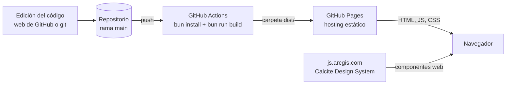
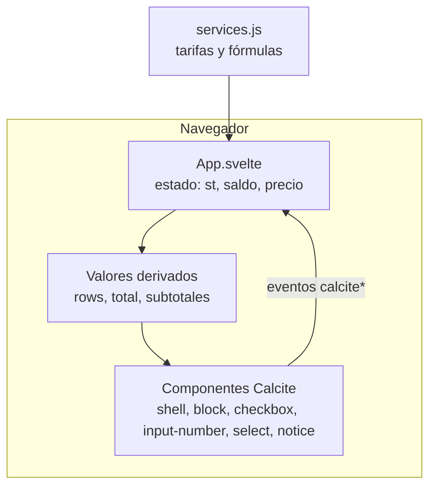

# Calculadora de créditos de ArcGIS Online

Estimación de créditos de ArcGIS Online de acuerdo con la [tabla oficial de créditos por servicio](https://doc.arcgis.com/es/arcgis-online/administer/credits.htm). La persona marca los servicios que va a usar, ingresa cantidades y ve el total al instante. Es una **estimación**: no guarda ni envía datos.

**Tecnologías:** Svelte 5 · Calcite Design System (componentes web de Esri) · Vite · Bun · GitHub Actions · GitHub Pages.

---

## Arquitectura

Es una **aplicación estática de una sola página (SPA)**. No tiene servidor, base de datos ni API propia: todo el cálculo ocurre en el navegador.

### 1. Cómo llega la aplicación al navegador (build y despliegue)



1. Cada cambio en `main` ejecuta el flujo `.github/workflows/pages.yml`.
2. El flujo instala dependencias con **Bun**, y **Vite** compila Svelte a HTML, CSS y JavaScript estáticos en `dist/`.
3. **GitHub Pages** publica `dist/` en `https://<usuario>.github.io/<repositorio>/`.
4. El navegador descarga esos archivos y, aparte, los componentes de Calcite desde el CDN de Esri.

### 2. Cómo funciona dentro del navegador (ejecución)



- **Datos (`src/services.js`):** lista `S` con cada servicio: nombre, tarifa mostrada, campos y la función `c(v)` que devuelve los créditos. Es el único archivo que cambia cuando cambia una tarifa.
- **Estado (`src/App.svelte`):** `st` guarda, por servicio, si está marcado y el valor de cada campo. Vive solo en memoria; al recargar la página se pierde.
- **Cálculo:** `rows` y `total` son valores derivados (`$derived`): se recalculan solos cuando cambia el estado. Los tamaños en KB, MB o GB se convierten a la unidad de la tarifa antes de calcular.
- **Interfaz:** componentes de Calcite. Al escribir o marcar algo, Calcite emite un evento (`calciteInputNumberInput`, `calciteCheckboxChange`, `calciteSelectChange`), el estado cambia y Svelte actualiza la pantalla.
- **Red:** la única conexión externa es la carga de Calcite desde `js.arcgis.com`. Sin internet, la página no puede dibujar los componentes.

### Decisiones de diseño

| Decisión | Motivo |
|---|---|
| Aplicación estática | Sin servidor que mantener; hosting gratuito en GitHub Pages |
| Todo el cálculo en el navegador | Resultado inmediato y sin guardar respuestas |
| Calcite desde CDN | Sin copiar archivos de componentes ni íconos; una sola línea en `index.html` |
| `base: './'` en Vite | La página funciona en cualquier repositorio sin cambiar rutas |
| Tarifas separadas de la interfaz | Actualizar un precio no requiere tocar la interfaz |
| Bun | Instalación y compilación rápidas con un solo archivo de dependencias (`bun.lock`) |

---

## Estructura

```
index.html                   Página base: carga Calcite y el script de la aplicación
src/main.js                  Arranque: monta App.svelte en <div id="app">
src/App.svelte               Interfaz, estado y cálculo
src/services.js              Tarifas y fórmulas
vite.config.js               Configuración de Vite (plugin de Svelte, base './')
package.json / bun.lock      Dependencias y comandos
.github/workflows/pages.yml  Compila y publica en GitHub Pages
```

## Probar en local (opcional)

Requiere [Bun](https://bun.sh).

```bash
bun install
bun run dev        # servidor local de desarrollo
bun run build      # genera dist/
```

## Publicar en GitHub Pages

1. En el repositorio: **Settings → Pages → Source → GitHub Actions**.
2. Suba los archivos a la rama `main`. Cada cambio compila y publica la página solo.
3. Revise el avance en la pestaña **Actions**; al terminar con check verde, la página está al día.

## Mantenimiento

**Cambiar una tarifa:** edite `src/services.js`, modifique el número en la fórmula `c` del servicio y guarde el cambio.

**Agregar un servicio:** copie una entrada de `S` y ajuste estos campos:

```js
{ g: 'Transacciones',                       // grupo: 'Almacenamiento' o 'Transacciones'
  t: 'Nombre del servicio',
  r: 'Tarifa que se muestra al usuario',
  f: [['n', 'Cantidad']],                   // campos: [id, etiqueta, valor inicial, opciones]
  c: v => v.n * 2 }                         // créditos a partir de los valores v
```

Para un campo de tamaño con selector KB/MB/GB use `SZ('id', 'Etiqueta', 'MB')`; la unidad indicada es la que usa la tarifa.

## Supuestos y límites

- Es una estimación; el consumo real puede variar. Verifique las tarifas vigentes en la documentación oficial antes de presupuestar.
- Las imágenes dinámicas usan 30 días por mes para la tarifa diaria.
- ModelBuilder y los notebooks interactivos cobran un mínimo de 10 minutos por sesión.
- El análisis de entidades e imágenes no tiene tarifa fija: se ingresa el valor del estimador de ArcGIS Online.
- Los tamaños se convierten con 1 GB = 1.024 MB y 1 MB = 1.024 KB.
- Calcite se carga desde el CDN de Esri con una versión fija (5.1). Para actualizarla, cambie el número en `index.html` y verifique la interfaz.
